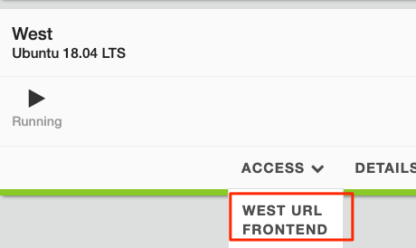

# Bacon App for F5 Beacon

## Requirements
* F5CS Account created and subscribed to Beacon
* Access to UDF (future versions should contain AWS infra deploy as well)

## Draft Steps
1. UDF will deploy the infrastructure and app containers on boot.
1. On the Control machine login to VSCODE under `Access Methods`

   

1. Update env vars with your:
    
    * F5CS Username: `export BEACON_UN='username'`
    * F5CS Password: `export BEACON_PW='password'`
    * F5CS AccountID: `export BEACON_ACCT='acctid'` (add notes how to get this)

1. Change directory to the ansible folder `cd /home/ubuntu/bacon_app/ansible`
1. Update `./bacon_app/ansible/vars.yaml` to include the HTTP endpoints of your East and West application. These will be used for destinations of your Beacon Monitors. If you are using UDF, check the **Access Methods** of the **East** and **West** servers for the `URL Frontend`. Place that in the appropriate section within the vars file. Example below:

    Retrieve URLs for East and West from UDF like below:

   

    Update the var file with the values for those URLs:

   

1. Activate the python virtual environment installed by the UDF setup scripts:

   `source /home/ubuntu/.venv/bin/activate`

1. Run the `beacon_config.yaml` playbook to configure your Beacon account and update the infrastructure with a token to send Telemetry metrics to Beacon. Below is a summary of what will be created:

    * Create Ingest Token in F5 Beacon
    * Update EAST/WEST telegraf data collectors with the Ingest Token to send data to your account
    * Model the **Bacon** application in F5 Beacon
    * Create Insights
    * Create Beacon Monitors
    * Create Metric Health Conditions

   Run the following Command:

   `ansible-playbook beacon_config.yaml`

   All Tasks should come back as **ok** or **changed**:

   

## Diagrams

## Clean Up
After you are done with the lab, there is an ansible playbook in the ansible folder called `beacon_clear.yaml`. It will delete objects that this lab automatically created. Keep in mind that if you manually add objects, the playbook will not know to remove those. If UDF shutsdown prior to running the cleanup playbook, it is possible to run it outside of UDF as long as you provide it your credentials.

   Run the following Command:

   `ansible-playbook beacon_clear.yaml`