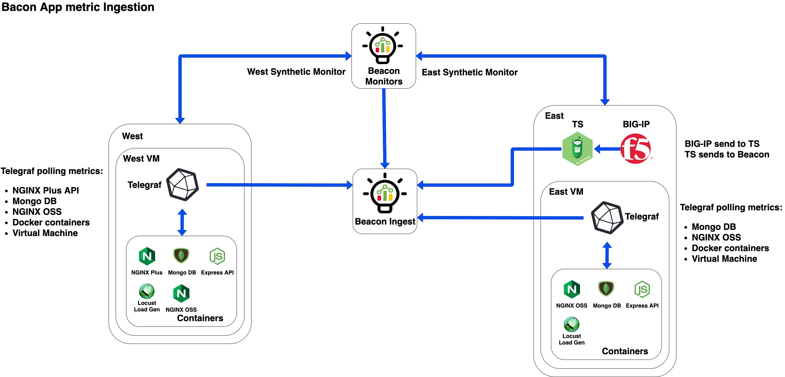
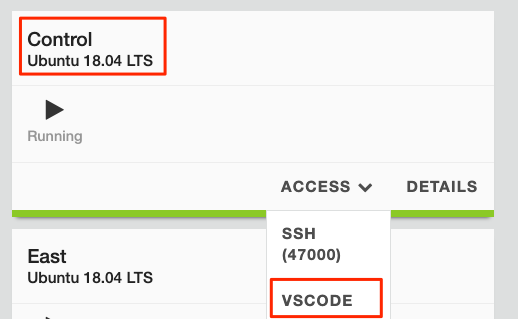
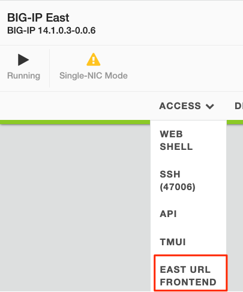
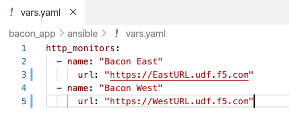
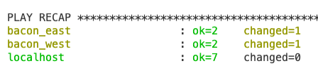
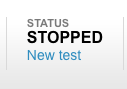
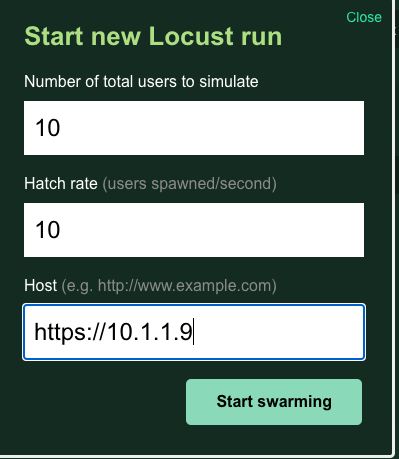
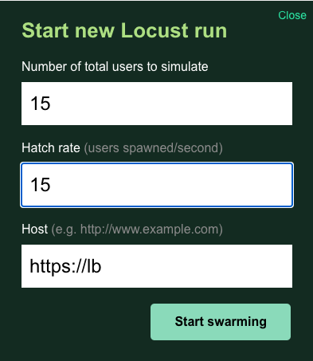

# Bacon App for F5 Beacon

## Sections
1. Lab Setup
1. Explore Beacon Portal and Lab Environment
1. MTTI / MTTK use-cases (using Beacon)
1. Configure, Update, and provision Beacon
1. Automate deployments and updates

## Requirements
* F5CS Account created and subscribed to Beacon
* Access to UDF (future versions should contain AWS infra deploy as well)

## Diagrams
Data ingestion flow for the Bacon application within this lab.

## Lab Setup
1. UDF will deploy the infrastructure and app containers on boot.
1. On the Control machine login to VSCODE under `Access Methods` using password "3eaconlab"

   

1. If you do not see a terminal located at the bottom of the screen, press `ctrl + ~` to make it appear.

   

1. Now we need to update enviornment variables with your F5CS information. Update the following commands with your information and paste them into the terminal.
    
    * F5CS Username: `export BEACON_UN='username'`
    * F5CS Password: `export BEACON_PW='password'`
    * F5CS AccountID: `export BEACON_ACCT='acctid'` (add notes how to get this)

1. Update `./bacon_app/ansible/vars.yaml` to include the HTTP endpoints of your East and West application. Navigate using the folder tree on the left hand side and select the **vars.yaml** file to open it.

   

1. Obtain the EAST and WEST URLs dynamically generated for your environment. 

   * The EAST region is running through BIG-IP. Select the  **Access** dropdown of the **BIG-IP East** server and select `EAST URL Frontend`. Place that in the appropriate section within the vars file. Example below:

   

   * The WEST region is running through NGINX Plus on the server itself. Select the  **Access** dropdown of the **West** server and select `WEST URL Frontend`. Place that in the appropriate section within the vars file. Example below:

   

   * Update the var file with the values for those URLs:

   

1. Activate the python virtual environment installed by the UDF setup scripts:

   `source /home/ubuntu/.venv/bin/activate`

1. Change directory to the ansible folder:

   `cd /home/ubuntu/bacon_app/ansible`

1. Run the `beacon_config.yaml` playbook to configure your Beacon account and update the infrastructure with a token to send Telemetry metrics to Beacon. Below is a summary of what will be created:

    * Create Ingest Token in F5 Beacon
    * Add the Ingest Token to Telemetry Streaming on BIG-IP
    * Update EAST/WEST telegraf data collectors with the Ingest Token to send data to your account
    * Model the **Bacon** application in F5 Beacon
    * Create Insights
    * Create Beacon Monitors
    * Create Metric Health Conditions

   Run the following Command:

   `ansible-playbook beacon_config.yaml`

   All Tasks should come back as **ok** or **changed**:

   

1. We will now begin sending load to our different environments using a tool named **Locust**.

    * Select the **Access** dropdown for the **East** server and select **Locust**
    * When the page loads select **New Test** in the top right.

    

    * The Virtual IP on the BIG-IP is `https://10.1.1.9` within UDF. Update the dialogue as below and select **Start Swarming**

    

    * Now follow the same steps for the **West** server but using the following values for the dialogue. `https://lb` is the container name for nginx plus within the environment.

    

1. Your environment should now be setup to begin the lab.

## Clean Up
After you are done with the lab, there is an ansible playbook in the ansible folder called `beacon_clear.yaml`. It will delete objects that this lab automatically created. Keep in mind that if you manually add objects, the playbook will not know to remove those. If UDF shutsdown prior to running the cleanup playbook, it is possible to run it outside of UDF as long as you provide it your credentials.

   Run the following Command:

   `ansible-playbook beacon_clear.yaml`