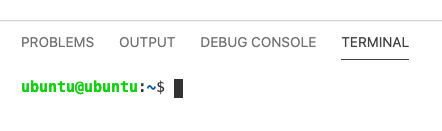
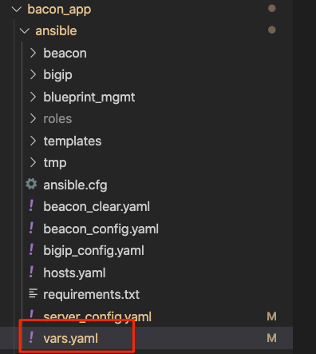
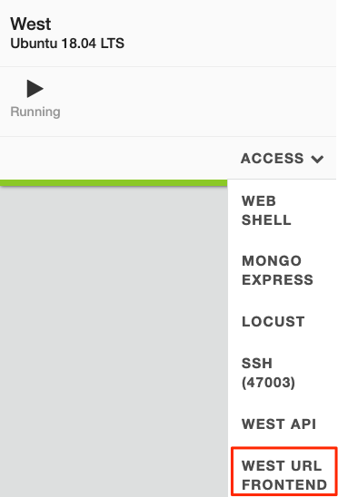

LAB Setup
=========

.. NOTE:: UDF will deploy the infrastructure and app containers on boot. Follow the steps below to connect the lab to your F5 Beacon account.

Steps
-----

#. On the Control machine login to VSCODE under `Access Methods` using password "3eaconlab"

   |control_vscode|

#. If you do not see a terminal located at the bottom of the screen, press `ctrl + ~` to make it appear.

   |terminal|

#. Now we need to update enviornment variables with your F5CS information. Update the following commands with your information and paste them into the terminal.

   .. code:: shell
   
      export BEACON_UN='username'
      export BEACON_PW='password'
      export BEACON_ACCT='acctid' (add notes how to get this)

#. Update ``./bacon_app/ansible/vars.yaml`` to include the HTTP endpoints of your East and West application. Navigate using the folder tree on the left hand side and select the **vars.yaml** file to open it.

   |vars_tree|

#. Obtain the EAST and WEST URLs dynamically generated for your environment. 

   * The EAST region is running through BIG-IP. Select the  **Access** dropdown of the **BIG-IP East** server and select `EAST URL Frontend`. Place that in the appropriate section within the vars file. Example below:

   |east_url|

   * The WEST region is running through NGINX Plus on the server itself. Select the  **Access** dropdown of the **West** server and select `WEST URL Frontend`. Place that in the appropriate section within the vars file. Example below:

   |west_url|

   * Update the var file with the values for those URLs:

   |vars_update|

#. Activate the python virtual environment installed by the UDF setup scripts:

   ``source /home/ubuntu/.venv/bin/activate``

#. Change directory to the ansible folder:

   ``cd /home/ubuntu/bacon_app/ansible``

#. Run the ``beacon_config.yaml`` playbook to configure your Beacon account and update the infrastructure with a token to send Telemetry metrics to Beacon. Below is a summary of what will be created:

   * Create Ingest Token in F5 Beacon
   * Add the Ingest Token to Telemetry Streaming on BIG-IP
   * Update EAST/WEST telegraf data collectors with the Ingest Token to send data to your account
   * Model the **Bacon** application in F5 Beacon
   * Create Insights
   * Create Beacon Monitors
   * Create Metric Health Conditions

   Run the following Command:

   ``ansible-playbook beacon_config.yaml``

   All Tasks should come back as **ok** or **changed**:

   |beacon_conf_run|

Your environment should now be setup to begin the lab.

.. |control_vscode| image:: images/lab_setup/control_vscode.png

.. |east_url| image:: images/lab_setup/east_url.png

.. |vars_update| image:: images/lab_setup/vars_update.png
.. |beacon_conf_run| image:: images/lab_setup/beacon_conf_run.png