Ingest 1: Create an HTTP(s) Beacon Monitor and Insight
======================================================

In this example, we are going to create a new Beacon monitor to check the API endpoints directly. Our environment already has internal monitoring coming from Telegraf for the API, but we should add an external test from Beacon so that we have visiblity into what a user would experience.

Steps
-----

Create the Monitor
^^^^^^^^^^^^^^^^^^

#. Before we configure the monitor for the API, open your our browser and manually test what a `GET` method will return from the API currently. Within your UDF portal components, select the **Access** drop down on the **West** server and then select **West API**

   |west_api_udf|

#. You will see a response payload with ``bacon = yummy`` and then the request headers that the server received from the request. Keep this browser tab open as we will need this full URL in one of the following steps.

   |apicheck|

#. Navigate in the Beacon portal to **Configuration >> Monitors** and select **Create >> HTTP(s) Monitor** in the top right.

   |createnew|

#. Configure the new monitor with the following inputs:

   * **URL** : West API URL from the browser
   * **Name** : ``Bacon West API``
   * **Interval** : ``30 seconds``
   * **Restponse string match** : ``yummy``
   * **Ignore SSL Errors** : ``checked`` (due to UDF trust)

   .. NOTE:: We are leaving the other settings default within the monitor, but notice that we have control over many aspects including HTTP method, how many failures must occur in order to be considered `Critical`, monitor timeout, redirect following, request body/headers, etc.

   |mon_config|

   Select **Save & Close** at the bottom of the monitor.

Review the Monitor and SSL Report
^^^^^^^^^^^^^^^^^^^^^^^^^^^^^^^^^
#. After about 1 minute, select the row (not the name itself) for the new monitor that you just created called **Bacon West API**. You will see a summary of this monitor including its health, overall latency, latency breakdown, and past health events. 

   |row_click|

   |mon_slideout|

#. At the top of the slide out, select the link for **SSL** to see the analysis that Beacon has performed on endpoint. This will show information such as protocols, ciphers, vulnerabilities, and a score related to the SSL landscape.

   |ssl_report|

Create an Insight
^^^^^^^^^^^^^^^^^

#. All of the data that you were seeing within the summary view of the monitor is also available for creating custom insights within Beacon. The insight we are going to create will visualize multiple metrics such as DNS latency, TLS Latency, httprRequest time, etc. Within the Beacon portal navigate to **Insights** and select **Create**.

#. For the first metric select the following values and click **Run**

   * **Source Type** : ``monitor``
   * **Metric** : ``dnsLookupMs``
   * **Filter** :
      *  **source** : ``Bacon West API``

   |insight_config|

   The graph created below may have a limited amount of data as the monitor was just created.

#. You can adjust the window of time displayed with the dropdown by selecting **1 day** and then using the slider to narrow focus.

   |adjust_insight|

#. To add another metric to this insight, select the **+** icon next to the current metric name near the top.

   |plus|

#. For this metric use the following values and then select **Run** again.

   * **Source Type** : ``monitor``
   * **Metric** : ``tlsHandshakeMs``
   * **Filter** :
      *  **source** : ``Bacon West API``

#. At this point you should see a point for DNS and TLS latency on your insight graph. Use the **+** icon again and add 1 more metric with the following parameters:

   * **Source Type** : ``monitor``
   * **Metric** : ``httpRequestTimeMs``
   * **Filter** :
      *  **source** : ``Bacon West API``

   You should now see all 3 metrics on your insight.

   |3metrics|

#. Scroll to the bottom of the page to save the insight. Fill in the forms with the following values and then select **Save & Close**.

   * **Title** : ``Bacon West API Latency``
   * **Category** : ``Operations``

   |save_insight|

Update the Bacon application
^^^^^^^^^^^^^^^^^^^^^^^^^^^^

#. Now that we have created the synthetic monitor and insight, it's time to associate them with our Bacon application. Navigate to **Application Landscape >> List View** and select the name of the **Bacon** application to enter the detailed view.

#. Toggle the application to **Edit Mode**.

   |edit_mode|

#. Select the **API-W** component and then click **Edit Component**.

   |api_w_component|

#. To associate the insight we created, select **Associated Insights** and add ``Bacon West API Latency`` (note that the list is searchable).

   |associate_insight|

#. Click **Save & Continue**

   On this page you can see that the **API-W** component already has 2 other **Metric Health Conditons** associated with it. One of them is for cpu level of the docker container and the other is the http response code that is returned by a Telegraf monitor. Let's add one from our new Beacon monitor.

#. Click on **Add** within **Metric Health Conditons** and fill out the form with the parameters below and then select **Add**.

   .. NOTE:: The **Metric Name** field will attempt to name itself based on the **Metric** that you select. You are able to update this field to name the metric something specific yo your use case (ie APIHealth).

   * **Metric Name** : ``healthStatus``
   * **Source Type** : ``monitor``
   * **Metric** : ``healthStatus``
   * **Filters** :
      *  **source** : ``Bacon West API``

   |mhc_form|

#. You will now see all 3 **Metric Health Conditions** associated with the component. If any of these have issues, it will now impact the health of the component and therfore the entire application.

   |all3_mhc|

#. Select **Save** in the bottom right for the component.

#. Select **Save** in the top right of the page for the entire application.

#. Exit edit mode using the toggle in the top left and then select the **API-W** component.

   |component|

   The slide-out will show the health, insights, and metric health associated with the component.

   .. NOTE:: You may need to adjust the time window or sliders to see data that is still beginning to come in.

   |sbs_insight| |sbs_mhc|

.. |createnew| image:: images/ingest1/createnew.png
    :scale: 75 %
.. |west_api_udf| image:: images/ingest1/west_api_udf.png
    :scale: 75 %
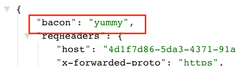
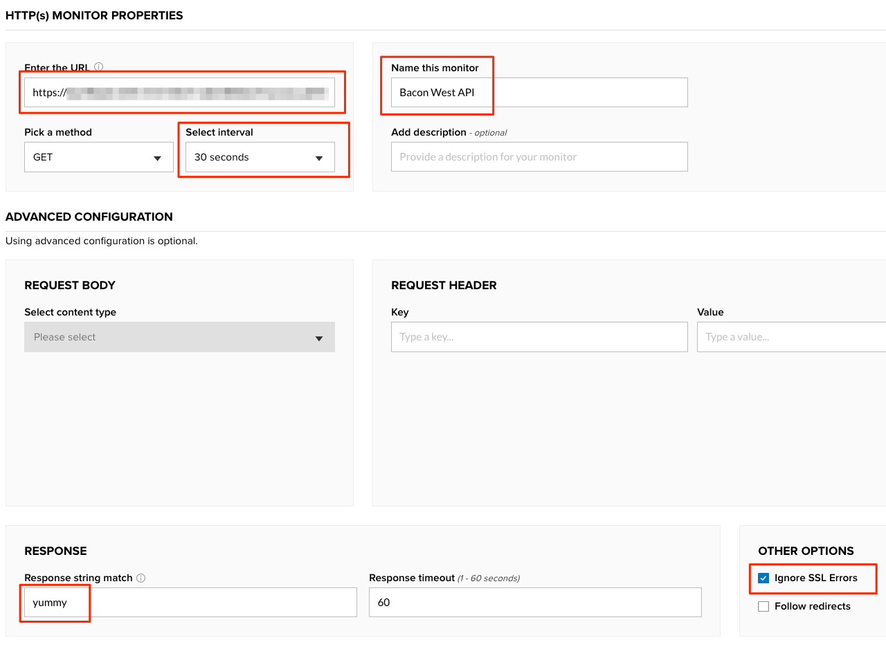
.. |insight_config| image:: images/ingest1/insight_config.png
    :scale: 60 %
.. |adjust_insight| image:: images/ingest1/adjust_insight.gif
    :scale: 60 %
.. |plus| image:: images/ingest1/plus.png
    :scale: 100 %
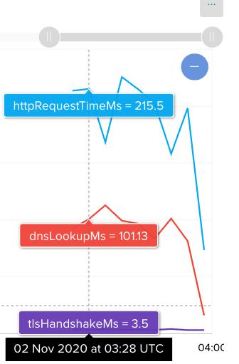
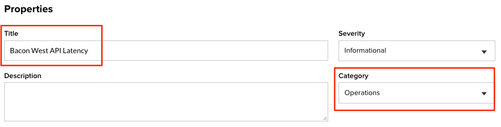
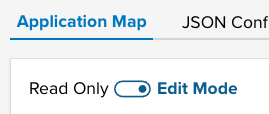
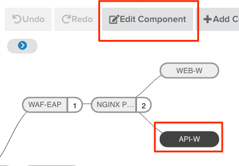
.. |associate_insight| image:: images/ingest1/associate_insight.png
    :scale: 100 %
.. |mhc_form| image:: images/ingest1/mhc_form.png
    :scale: 100 %
.. |all3_mhc| image:: images/ingest1/all3_mhc.png
    :scale: 100 %
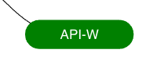
.. |sbs_insight| image:: images/ingest1/sbs_insight.png
    :width: 49 %
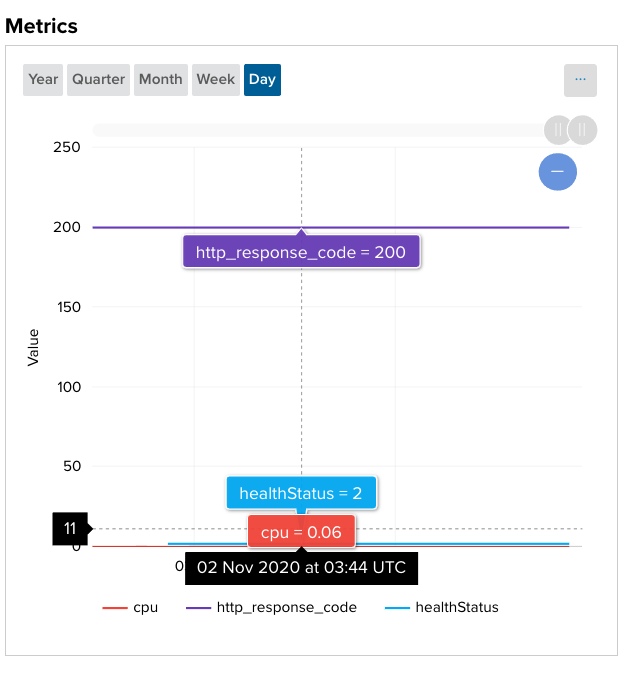
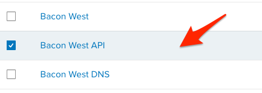
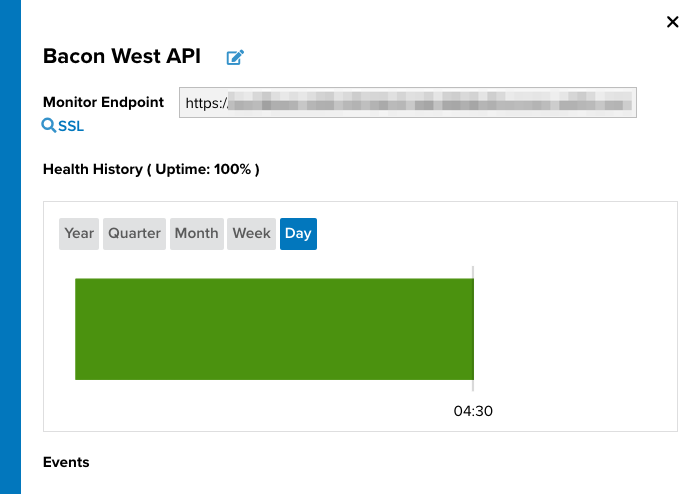
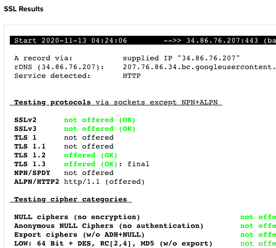