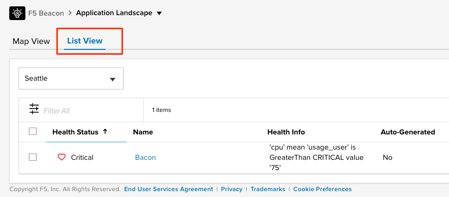
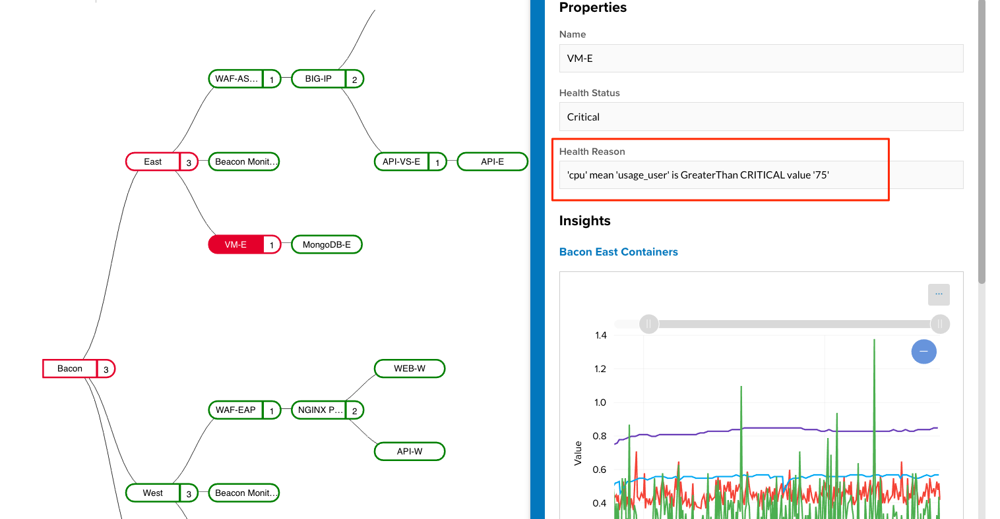
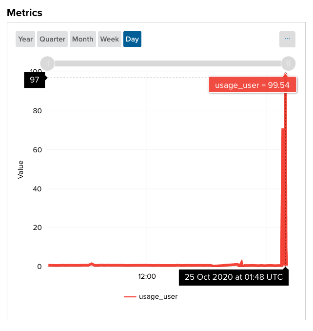
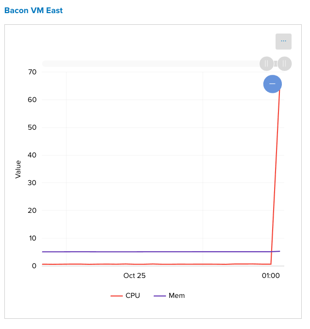

Scenario 1: High Server CPU
===========================

In this scenario, we will run an ansible playbook which will consume CPU cycles on either the East or West VM hosting the **Bacon** application. After running the playbook and waiting for data to ingest into Beacon we will review the application in the portal to narrow down where in the application the issue is occuring.

Steps
-----

#. Run the ``scenario1.sh`` script to spike the CPU on one of the VMs. This script takes around 5 min to finish, but after only 1-2 min we should see the metrics updating health within the Beacon portal.

   .. code:: shell

      ~/bacon_app/scenarios/scenario1.sh

#. After 1-2 minutes of the playbook running, navigate to the F5 Beacon portal to the **Application Landscape >> List View**. You will notice that the application is showing either Critical or Warning state. The state will eventually transition to Critical but may pass through Warning as the CPU rises. If your state still shows Healthy, try refreshing the page until it updates. Notice that the **Health Info** column gives you a preview of what metric most recently impacted the health of the application.

   |health_in_nav|

#. Select the name of the application to navigate to the detail page of the **Bacon** app.

   .. NOTE:: In this view you can cleary see that the issue is coming from the East Virtual Machine. It is just as importan that you can see all of the components which are still Healthy according to Beacon. This allows you to narrow focus to just the VM reporting the issue.

#. Select the **East** component and the information within the slide-out.

   - At the top in **Health Reason** we can see the metric of `cpu usage_user` went above `75%`

   |health_cpu_over_75|

   - As you scroll through the slide-out you will see both an **Insight** and a **Metric Health Condition** displaying the mentioned increase. Use the sliders on the graphs to narrow down to the right side of the graph for the most recent data.

   |insight_over75| |metric_over75|

#. Under the **Bacon** application select the **Health & Events** tab. Here you will see the Events related to the current CPU spike. You can narrow the focus of the **Health History** bar by selecting **Day** as the view just as the screenshot below has.

   .. NOTE:: Your health history may be different than the image below depending on what scenarios or labs you have already done.

   |hae|

As an application owner I can now focus my attention on a team to investigate the **East VM** itself. Without beacon I would require each team to proove it is not their problem if the CPU spike is causing an outage for the application.

.. |hae| image:: images/scen1/hae.png
    :scale: 75 %
