Scenario 2: BIG-IP Virtual Down
===============================

In this scenario, we will cause the BIG-IP LTM Pool for the East web-service to fail its health check which will cause the VirtualServer to go offline. We will then use the Beacon portal to identify where in the application map the issue is occuring.

Steps
-----

Create the Outage
^^^^^^^^^^^^^^^^^

#. Run the ``scenario2.sh`` script to bring down the BIG-IP VirtualServer for the web server in the East region.

   .. code:: shell

      ~/f5-beacon-lab/scenarios/scenario2.sh

   The script runs an ansible playbook that should have no errors or failures:

   |pbrun|

#. **Telemtry Streaming** on BIG-IP sends updates to Beacon every 60 seconds. Within 1-2 minutes the state change should reflect within Beacon. Navigate in the Beacon portal to **Application Landscape >> List View** and click the name of the **Bacon** application.

   In the application map we can see that there are a few things going on:

   - The **Beacon Monitor** in the East region. This tells us that an external user most likely would be failing as the Beacon synthetic is failing.
   - The **WEB-VS-E** component which represents the Web VirtualServer on the BIG-IP is reporting a Critical status.
   - Just as important to note, is that the **WEB-E** appliation itself is still reporting green. This means the internal http monitor from telegraf is still passing. This further confirms that the issue appears to be with the BIG-IP VS.
   - The app-map also shows that the entire **West** region appears to be in a Healthy state.

   .. NOTE:: UDF proxies the services and can cache the page us **UP** when the BIG-IP Virtual is actually offline. The Beacon Monitor may be hitting the UDF cache and stay up longer than expected. If your app-map shows the VS critical but the Monitor healthy, this is why. In another scenario we force the response string for the Beacon monitor to fail regardless of the cache.

   |app_map|

   Now let's review some of the specific components.

#. Select the **Beacon Monitor** component.

   Note that the Critical Health Reason is give at the top of the component showing us that the health check is failing connection.

   |mon_reason|

#. Scroll down to the **Metrics** section and you can see that the **healthStatus** metric score has increased to an unhealthy level. It may help to select **Day** resolution in the metric graph like the screenshot below. You can then use the slide to narrow in on the most recent time.

   |health_score|

   .. NOTE:: You can view what the various health scores mean |health_numbers| 

#. Now select the **WEB-VS-E** component and you can see that the health Metric has also increaed to an unhealthy level. Since this component has a **metric-health-conditon** associated with a BIG-IP VirtualServer, we can correlate that the VirtualServer is having issues.

   |web_vs_health| 

Fix the Outage
^^^^^^^^^^^^^^
Now that we know which component is having the issue, we can go to the BIG-IP to resolve the outage. For the sake of the demo, we will guide you to the correct section within BIG-IP.

#. Login to the TMUI of the BIG-IP so that we can find and fix the issue. From the UDF portal select the **Access** dropdown for the **BIG-IP** instance and select **TMUI**.

   |tmui_link| 

   Login with credentials:

   - username: ``admin``
   - password: ``3eaconlab``

#. Navigate to **Local Traffic >> Pools** and then change the Parition to **FrontEnd**.

   |lt_pools|  |partition|

#. On this screen you can see that the **web_pool** is offline and red.

   |pool_red|

#. Click the name of the **web_pool** to view its settings.

   This application performs TLS offloading with the BIG-IP which means that it does not need encryption to the backend pool members. In this case we can see that someone has changed the health monitor to **https** which will fail when the backend is not expecting a TLS request.
   
   |https_mon|

#. Go ahead and change the monitor back to **http** by removing the https monitor and adding the http monitor and then select **Update**. After a few seconds you can refresh the BIG-IP TMUI to see the status turn Green again.

   |monchange|

#. Navigate back to the **Bacon** application in the Beacon portal. After 1-2 minutes the new health status will be sent from BIG-IP to Beacon. Refresh the Beacon portal on the **Bacon** application to see that both the **Beacon Monitor** and the **WEB-VS-E** components have become Healthy again.

   |healthy_again|

#. Finally, navigate over to the **Health & Events** tab to see the historical events for the changes that were just made. On this page we can see the critical state on the health history bar as well as the events for each components health changes.

   |hae|

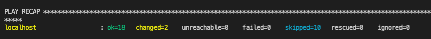
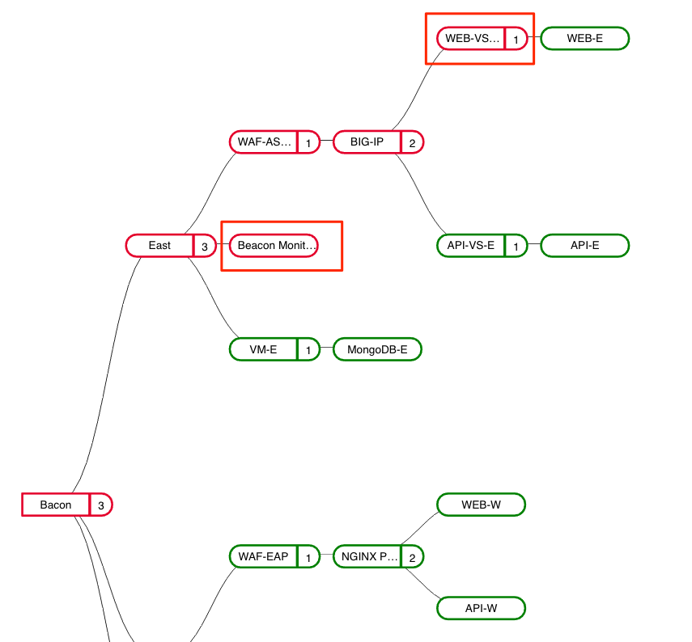
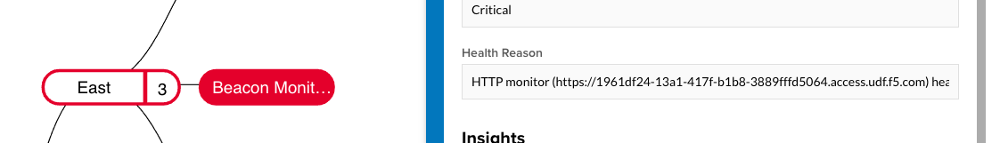
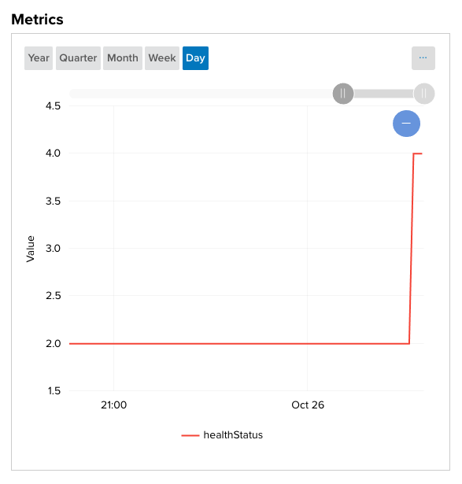
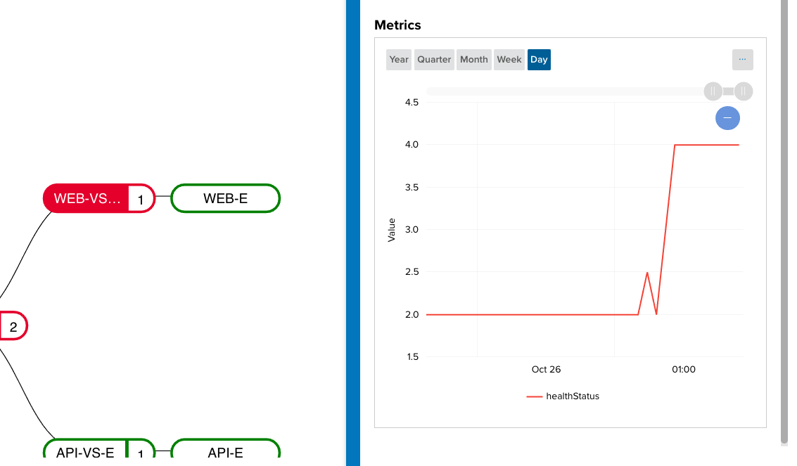
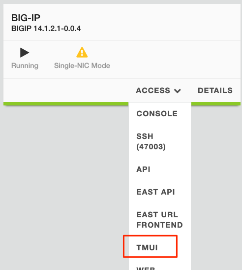
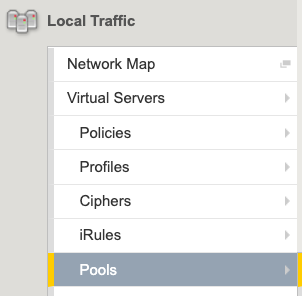
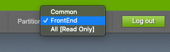
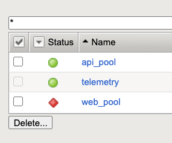
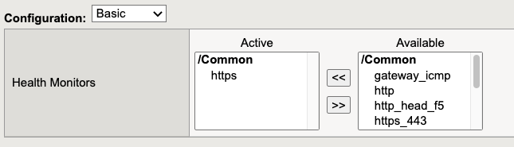
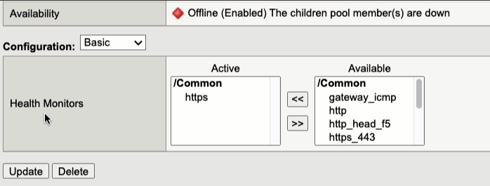
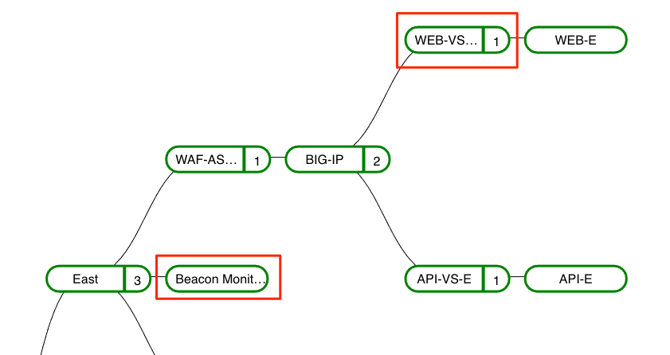
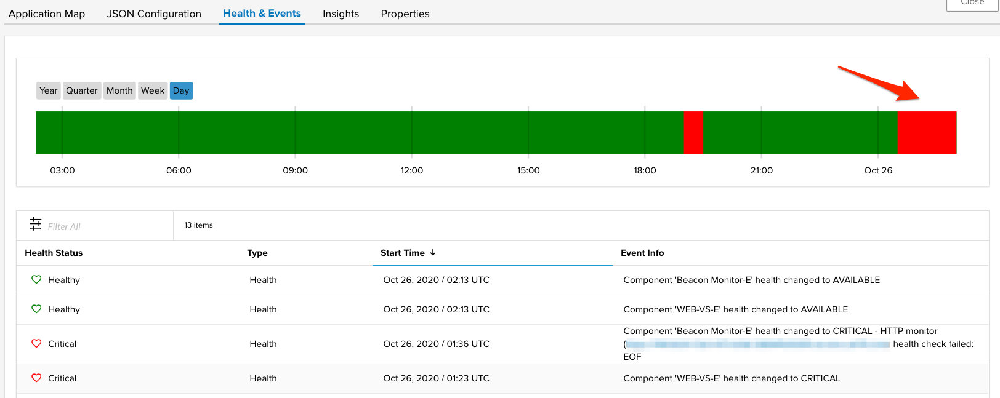

.. |health_numbers| raw:: html

   <a href="https://clouddocs.f5.com/cloud-services/latest/f5-cloud-services-Beacon-WorkWith.html#set-component-health-settings" target="_blank">here</a>

