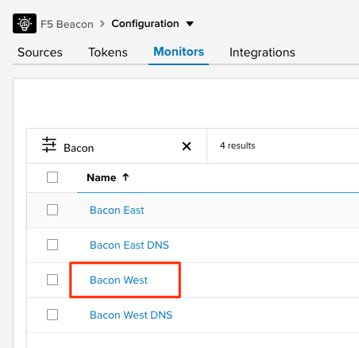
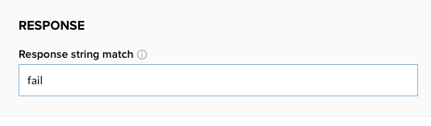
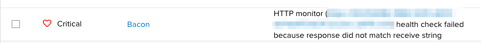
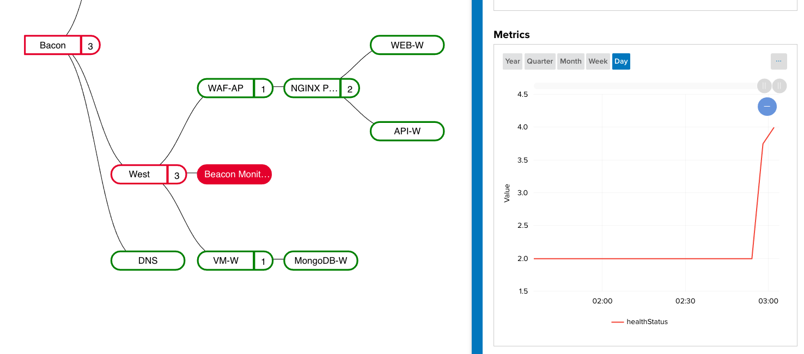
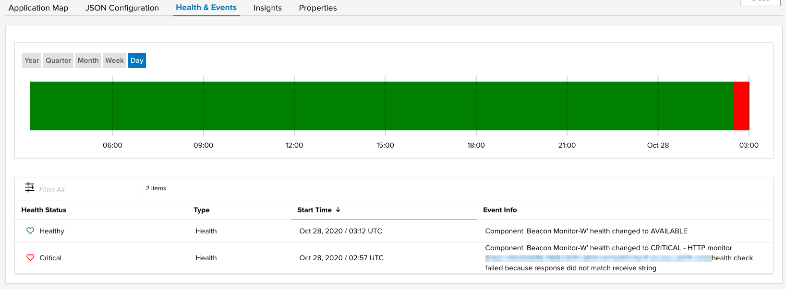

Scenario 3: Beacon Monitor Response String
==========================================

In the last scenario, the BIG-IP VirtualServer was offline which then caused the Beacon synthetic monitor to fail. In this scenario, we will create a situation where the Beacon synthetic monitor fails due to an expected response string not being found. Beacon monitors allows for you to specify an expected response string which must be returned by the endpoint in order for the monitor to be considered Healthy. This scenario will cover how this monitor failure will be represented within our application.

Steps
-----

#. Navigate in the Beacon portal to **Configuration >> Monitors** and click the name of the **Bacon West** monitor.

   |bcn_west|

#. Update the **Response string match** parameter with the value `fail`. This endpoint does not return the string `fail` which cause this monitor to become critical. 

   |fail|

   After updating, select **Save & Close** at the bottom of the screen.

#. After 1-2 minutes for the monitor and health to log failures, navigate back to **Application Landscape >> List View**. You will see that the Bacon application is showing Critical and has the summary reason listed in the **Health Info** column.

   |fail_summary|

#. Click on the name of the **Bacon** application to go to the detail view. Using the application map, we can quickly determine that the failure is from the synthetic monitor in the **West** region. We can also see that the downstream services all appear to healthy and responding. 

   |detail_fail|

   This failure would indicate that either something specific that Beacon is monitoring on the application is failing, or there is a misconfiguration of the monitor itself. While we know that we are the ones that just set the response string to fail, this could have easily been a configuration mistake on the application side causing the string to stop returning.

#. To reset the monitor, navigate back to **Configuration >> Monitors** to the **Bacon West** monitor. Remove the string `fail` from the **Response string match** and then select **Save & Close**.

#. Finally, navigate over to **Application Landscape >> List View >> Bacon**  and select the **Health & Events** tab to see the historical events for the changes that were just made. On this page we can see the critical state on the health history bar as well as the events for each components health changes.

   |hae|

