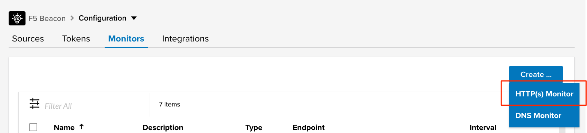
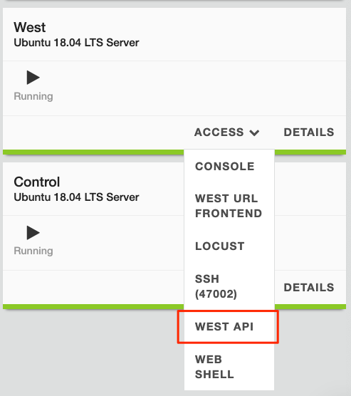
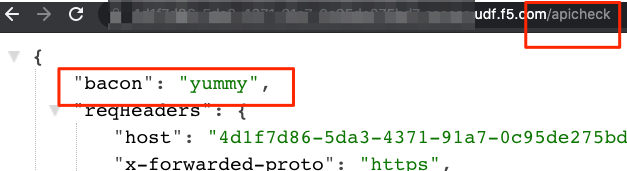
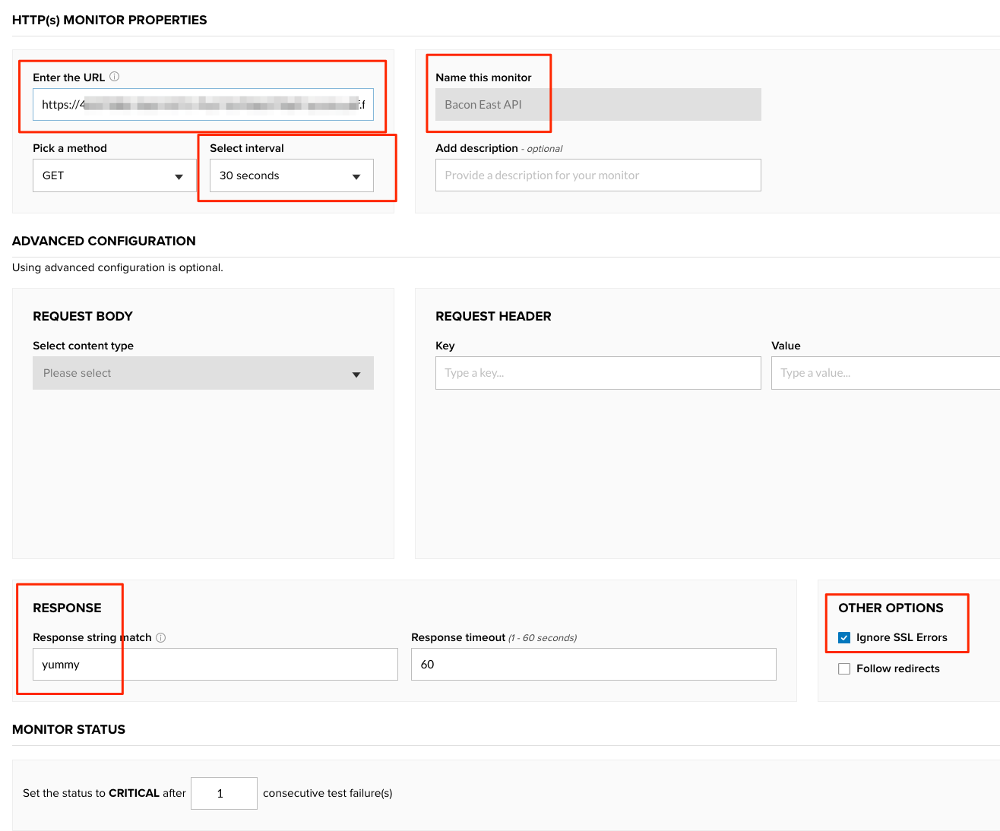

Scenario 4: Monitor the Bacon API with Beacon
=============================================

In this lab, we are going to create a new Beacon monitor to check the API endpoints directly. Our environment already has internal monitoring coming from Telegraf, but we should add an external test from Beacon so that we have visiblity into what a user would experience.

Steps
-----

#. Before we configure the monitor for the API, let's open a our browser and mnaually test what a `GET` method will return from the API currently. Within your UDF portal components, select the **Access** drop down on the **West** server and then select **West API**

   |west_api_udf|

#. Add ``/apicheck`` to the end of the browser URL and you should see a response payload with ``bacon = yummy`` and then the request headers sent to the server. Keep the browser tab open as we will need this full URL in one of the following steps.

   |apicheck|

#. Navigate in the Beacon portal to **Configuration >> Monitors** and select **Create >> HTTP(s) Monitor** in the top right.

   |createnew|

#. Configure the new monitor with the following inputs:

   * **URL** : West API URL from the browser including ``/apicheck`` at the end
   * **Name** : ``Bacon West API``
   * **Interval** : ``30 seconds``
   * **Restponse string match** : ``yummy``
   * **Ignore SSL Errors** : ``checked`` (due to UDF trust)

   .. NOTE:: We are leaving the other settings default within the monitor, but notice that we have control over many aspects including HTTP method, how many failures must occur in order to be considered `Critical`, monitor timeout, redirect following, request body/headers, etc.

   |mon_config|

