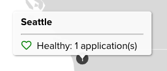

F5 Beacon Overview
==================

In this section we will go over the different sections within the Beacon portal. You will notice many of the objects created during the `lab setup` portion of this lab.

.. NOTE:: If you have existing applications or configuered objects with Beacon, your portal may appear slightly different than this guides examples.

Navigate to the |Portal| and login using your F5 Cloud Services account. This link will take you directly to the Beacon service within the portal.

Application Landscape
---------------------

#. After logging, you will land on the **Application Landscape** page within F5 Beacon. This section will display your current applications in either a **Map View** or a **List View** which correlate to the tabs at the top of the page.

   |app_landscape|

#. On the current Map, you will see the **1** badge over Seattle. This represents the **Bacon** application that the `lab setup` section created. If you hover over the badge, you will see that the application is currently **Healthy**.

   |hover_app|

Configuration
-------------

Insights
--------

Dashboards
----------

TODO

.. |app_landscape| image:: images/overview/app_landscape.png

.. |Portal| raw:: html

   <a href="https://portal.cloudservices.f5.com/beacon" target="_blank">F5 Beacon Portal</a>