F5 Beacon & App Overview
========================

In this section we will review the different concepts and pages within the Beacon portal. You will notice many of the objects created during the `lab setup` portion of this lab.

.. NOTE:: If you have existing applications or configuered objects with Beacon, your portal may appear slightly different than this guides examples.

Section Summary:
   - **Application Landscape:** The application inventory within beacon (map/list view).
   - **Configuration:** Create synthetic monitors, manage data ingest tokens, manage data sources, integrate information.
   - **Insights:** Visualize, Analyze, and Correlate data metrics ingested into Beacon. 
   - **Dashboards:** Group insights, applications, and Beacon data into single view dashboards.

Navigate to the |Portal| and login using your F5 Cloud Services account. This link will take you directly to the Beacon service within the portal.

Application Landscape
---------------------

#. After logging in, you will land on the **Application Landscape** page within F5 Beacon. This section will display your current application inventory in either a **Map View** or a **List View**. These views align to the tabs at the top of the page.

   |app_landscape|

#. On the current Map, you will see the **1** badge over Seattle. This represents the **Bacon** application that the `lab setup` section created. If you hover over the badge, you will notice that the application is currently **Healthy**.

   Clicking on the badge will take you to the **List View** tab. Navigating to this page by clicking a badge will filter the list of applications to those that match the location that you selected. Go ahead and click the badge.

   |hover_app|

#. Click the name of the **Bacon** application to navigate to the details page of this application.

   |app_name|

#. On this page there are a number of tabs across the top that display different information about the curent application. Feel free to click through these tabs and look around.

   - **Application Map:** The dependency map of your application components.
   - **JSON Configuration:** The declarative API payload needed to create the current application. Note that the JSON is also editable directly in the portal.
   - **Health & Events:** The health history of the application along with an event history.
   - **Insights:** Insights associated with the current application as well as a column identifying which specific component within the application the insight is associated with.
   - **Properties:** Meta-data properties/labels associated with the top level component of the application.

   |

   We will be leveraging these different tabs throughout the lab as more data and events occur.

#. Navigate back to the the **Application Map** tab to dig a bit deeper.

   You can quickly see the current health for all application components based on the outline color of each:

   .. NOTE:: A component is a logicial object within an application map that derives its health from various metrics, dependencies, and child components. Being that they are logical, you could have components that map 1:1 with a specific service or appliance within your infrastructure, or you could have 1 component combining metrics and health from multiple sources of data.

   - Healthy(green)
   - Warning(yellow)
   - Critical(red)
   - Uknown(grey)
   - Disabled(blue)

   |

   While you are in the default `Read Only` mode, selecting a component on the Application Map will show details about that component including Health, Associated Insights, and Metric-Health-Conditions.

#. As an example, select the **MongoDB-E** component to see the detail view slide out.

   |mongo_e|
   
   In the information panel we see that this component is currently in a **Healthy** state.

   |mongo_healthy|

   Below the health we can see that this component has 1 Insight associated with it. The insight is showing metrics regarding the database connections, inserts, deletes, queries, etc. This would help a Beacon user quickly identify changes around these metrics.

   |mongo_insight|

   Below the insights, we can see **Metrics** that are being used by the component to calculate health. In this example you can see that the component is deriving its health by looking at **current connections** to the database. The graph shows the current level.

   .. NOTE:: You may not initially see data on the graph depending on how recently you started the lab before getting to this point. If you select the **Day** view and then move the slider to the most recent time it may help see data.

   |mongo_metrics|

#. Next let's look at this component in the edit view to see how it was setup. Switch the toggle in the top left to **Edit**, make sure the **MongoDB-E** component is selected, and then select **Edit Component**.

   |edit|

   On this slide-out you can modify the name, description, associated insights, and meta-data labels of this component.

#. Select **Save & Continue**. On the next slide-out is where the health of the component is controlled.

   - **Actual Health:** How health is determined for this component when taking into account this components health as well as all child components.
   - **Metric Health Conditions:** Various metrics used for this component to derive health (in this case there is only 1, but there can be multiple).
   - **Component Health:** Comparing all **Metric Health Conditions** to come up with a final health for this component.

   We can see that there is currently one **connections_current** health conditon currently applied to this component. Go ahead and click on it to see the details.

   |met_health_cond|

#. You now see the **Metric Health Conditon** edit page. There are multiple parameters on this tab:

   **Metric Selection**

   - **Metric Name:** Text field that allows you to name the condition for use on graph legends (useful if you apply similar metrics to 1 component).
   - **Source Type:** What type of data the metric will be (bigip-virtual, mongodb, cpu, docker, etc)
   - **Metric:** Which specific metric you will use (connections, reads, deletes...this is dependent on the source type)
   - **Filters:** Narrows down the specific metric to use (an example would be filtering to a specific BIG-IP VS name and BIG-IP Host as that would be unique )

   |
   
   **Metric Condition**

   This section defines when this metric triggers a **Critical** or **Warning** condition. In this example the metric is evaluated every 1min, if the **Mean** of that data is **Greater than** the threshold of **20** or **25** set the health accordingly.

#. Procced to select **Cancel** on the slide-out windows until you are back at the main App Map for the **Bacon** app.

Configuration
-------------

#. Select the main menu dropdown and select **Configuration**.

   |configuration|

   Lets review each of the tabs in this section.

#. **Sources** lists out the different sources of data being sent to your beacon account. You should see multiple sources ingesting based on the blueprint.

   - **Bacon East/West (monitor):** Beacon synthetic HTTPs monitors hitting the BIG-IP/NGINX frontdoor
   - **bacon_east / bacon_west (telegraf):** Telegraf instance collecting metrcis from the East VM, docker, mongo, nginx, etc 
   - **bacon-bip.local (bigip-system):** Telemetry Streaming (TS) sending System, AVR, Poller metrics
   - **Bacon East/West DNS (dns-monitor):** Beacon synthetic DNS monitors
   - etc

   You can see the last time Beacon received data from the source by reviewing the **Last Contact** column. In this lab TS is setup to every 60 seconds, monitors and telegraf are every 30 seconds.

#. Next select the **Tokens** tab. Here you can see the various tokens used to ingest data into this Beacon account. The **bacon_token** is being used by both instances of Telegraf as well as the BIG-IP. Each synthetic monitor creates their own token as well.

#. Now select the **Monitors** tab. You can see the 4 synthetic monitors created. Go ahead and click on the link for **Bacon East**.

   |east_mon|

   Here you can see the various settings for this monitor such as URL, Interval, Headers, Response string matching, etc. You can even control how many consecutive failures must occur before the monitor is considered down. We will review more on monitors while setting them up in later sections of the lab.

Insights
--------

#. Select the main menu dropdown and choose **Insights**. Insights within Beacon allow you to group multiple metrics based on time, type, function, etc to gain actionable outcomes.

   Click on the **Bacon East Monitor** as an example (notice you can use the filter as in the screenshot below).

   |east_monitor|

#. Across the top of the **Insight** there are various metrics that are included. Reviewing the first selected metric of **tlsHandshakeMs** we can see the various parameters used to display it. These parameters should seem very similar to **Metric Health Conditons** in the Application settings as they are referencing the same metrics. The columns that help you narrow down the data include:

   - **Source Type:** What type of data the metric will be. In this case it is *Monitor* (Beacon Synthetic Monitor).
   - **Metric:** Which specific metric you will use. In this case *tlsHandshakeMs* is selected.
   - **Filters:** Narrows down the specific metric to use. In this case we selected the *source* of the monitor as *Bacon East*.
   - **Function:** A function to apply to the metrics (mean, max, sum, etc). In this case we have *Mean* selected.

   |tls_metric|

#. Click through the different metric tabs for the insight to see the settings selected for each one. Do not change any of the values as these will be used in future labs.

Dashboards
----------

#. Dashboards allow you to combine multiple insights and applications into a single view. Creation of a dashboard will be covered in the **Configure & Ingest** portion of this lab.

Now that we have had a brief introduction to the various sections and features within Beacon, please proceed to the **Demo Scenarios** or **Configure Beacon & Ingest Data** portions of this lab.

.. |app_landscape| image:: images/overview/app_landscape.png
   :scale: 70 %  
.. |hover_app| image:: images/overview/hover_app.png
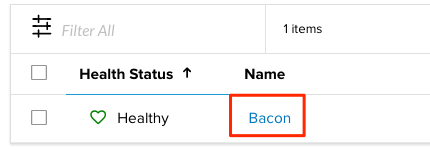
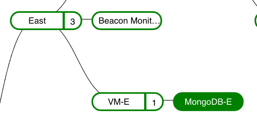
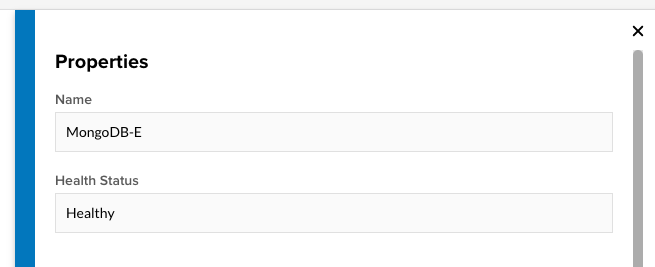
.. |mongo_insight| image:: images/overview/mongo_insight.gif
   :scale: 70 %
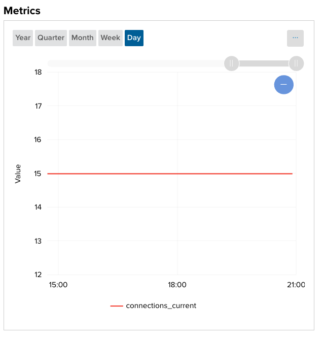
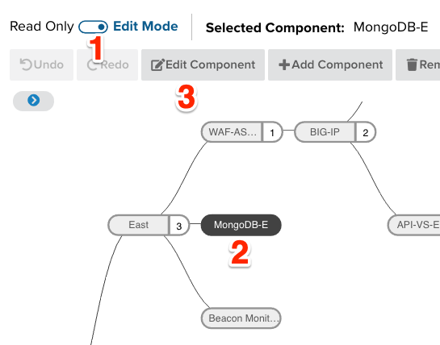
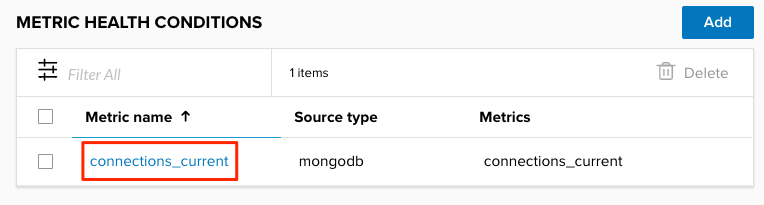
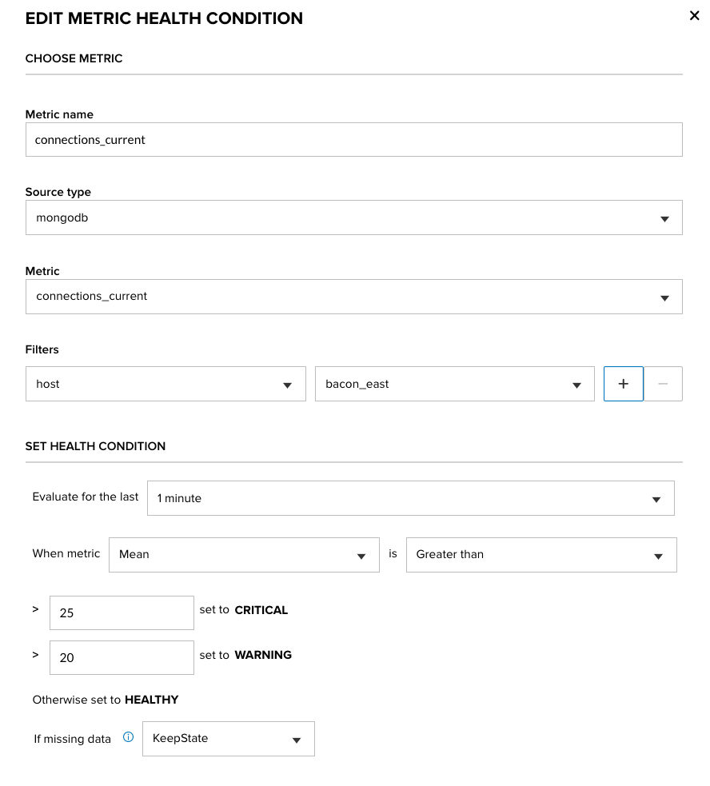
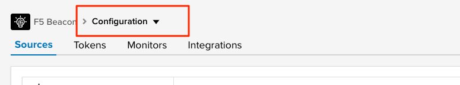
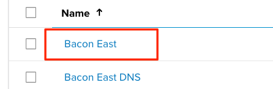
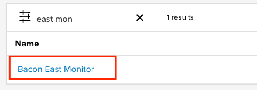
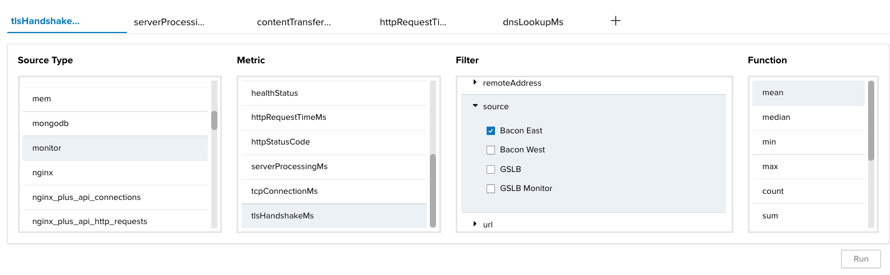

.. |Portal| raw:: html

   <a href="https://portal.cloudservices.f5.com/beacon" target="_blank">F5 Beacon Portal</a>
